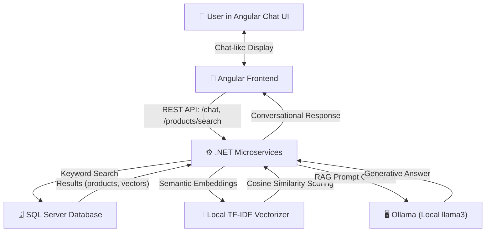

# AuraStore 🛍️ - E-Commerce with Angular and Microservices RAG Chatbot

Welcome to **AuraStore**, a modern, state-of-the-art e-commerce application powered by **Angular**, **.NET 10**, **SQL Server**, and **Retrieval-Augmented Generation (RAG)** using **Ollama**.

AuraStore delivers a premium shopping experience featuring advanced vector search, interactive catalog filters, dynamic cart functionality, and **Aura AI**—your local conversational AI assistant that retrieves matching store products from the SQL Database to answer your questions.

The backend is fully decoupled and optimized into a **Microservices Architecture**.

---

## 🏗️ Architecture



### 1. Frontend (Angular)

- Built using Angular's modern **Standalone Components**, **Signals** for reactive state management, and **computed signals** for performance-optimized filtering.
- Implements a stunning, highly responsive **glassmorphic design system** with custom micro-animations.

### 2. YARP API Gateway

- Runs on port `5194` to serve as the unified API Gateway for the frontend, forwarding routes to the correct microservice and maintaining CORS policies.

### 3. ProductService

- Runs on port `5001`. Connects to SQL Server using Entity Framework Core, manages product details, and implements local TF-IDF semantic vector searches.

### 4. ChatService (RAG Engine)

- Runs on port `5002`. Decoupled from the database, it queries `ProductService` over HTTP for product vector search data, handles prompt engineering context, and communicates with a local **Ollama** server running `llama3` to generate friendly shopping assistance.

---

## ✨ Features

- 🔍 **Semantic Product Search**: Search for products conceptually rather than just by exact keyword matches (e.g. searching _"lighting"_ will correctly score _"Aura Smart Ambient Light"_).
- 💬 **Interactive AI Assistant (Aura AI)**: Floating chat widget utilizing local RAG context matching.
- ⚡ **Suggested Quick-Action Chips**: Clickable pre-configured query buttons (e.g. _"Show products under $100"_, _"Recommend a keyboard"_) to instantly test the RAG flow.
- 🛒 **Rich Context Cart Cards**: Add items directly to your shopping cart straight from the AI's chat bubble suggestions.
- 🎛️ **Advanced Sidebar Filters**: Category-specific views and a smooth price slider.
- 📦 **Responsive Layout**: Designed with robust media queries and responsive `max-height` constraints to fit all screen sizes beautifully without scrolling issues.

---

## 🚀 Getting Started

### Prerequisites

- [Node.js](https://nodejs.org/) (v18+) & `npm`
- [.NET SDK 10.0](https://dotnet.microsoft.com/download/dotnet/10.0)
- [SQL Server LocalDB / Express](https://learn.microsoft.com/en-us/sql/database-engine/configure-windows/sql-server-express-localdb)
- [Ollama](https://ollama.com/) (Optional, needed for Generative RAG responses)

---

### Step 1: Start Ollama (Conversational Engine)

Install Ollama, open your terminal, and download/run the `llama3` model:

```bash
ollama run llama3
```

_Note: Keep this terminal window open. AuraStore will communicate with Ollama on port `11434`._

---

### Step 2: Set Up and Run the Backend Microservices

1. Navigate to the Backend folder:
   ```bash
   cd Backend
   ```
2. Update the Database Connection String in `ProductService/appsettings.json` under `DefaultConnection` if you use a custom SQL Server instance.
3. Run the microservices startup script:
   ```powershell
   .\run.ps1
   ```
   _Note: This starts `ProductService` (port 5001), `ChatService` (port 5002), and the `Gateway` (port 5194) simultaneously._

Alternatively, you can run them manually in separate terminal windows:

```powershell
dotnet run --project ProductService/ProductService.csproj
dotnet run --project ChatService/ChatService.csproj
dotnet run --project Gateway/Gateway.csproj
```

---

### Step 3: Set Up and Run the Frontend

1. Navigate to the Frontend folder:
   ```bash
   cd Frontend
   ```
2. Install dependencies:
   ```bash
   npm install
   ```
3. Start the Angular Dev Server:
   ```bash
   npm start
   ```
   Open your browser to [http://localhost:4200](http://localhost:4200) to explore the store!

---

## 📂 Key Codebase Entry Points

- **Frontend Component logic**: [app.ts](file:///d:/EcommercewithAngularandRAG/Frontend/src/app/app.ts)
- **Frontend Template UI**: [app.html](file:///d:/EcommercewithAngularandRAG/Frontend/src/app/app.html)
- **Design & Styles**: [app.css](file:///d:/EcommercewithAngularandRAG/Frontend/src/app/app.css)
<<<<<<< HEAD
- **API Gateway Config**: [appsettings.json (Gateway)](file:///d:/EcommercewithAngularandRAG/Backend/Gateway/appsettings.json)
- **API RAG Coordinator**: [RagsService.cs](file:///d:/EcommercewithAngularandRAG/Backend/ChatService/Services/RagsService.cs)
- **Local TF-IDF Vectorizer**: [SemanticSearchService.cs](file:///d:/EcommercewithAngularandRAG/Backend/ProductService/Services/SemanticSearchService.cs)
- **Database Seeder**: [EcommerceDbContext.cs](file:///d:/EcommercewithAngularandRAG/Backend/ProductService/Data/EcommerceDbContext.cs)
=======
- **API RAG Coordinator**: [RagsService.cs](file:///d:/EcommercewithAngularandRAG/Backend/EcommerceApi/Services/RagsService.cs)
- **Local TF-IDF Vectorizer**: [SemanticSearchService.cs](file:///d:/EcommercewithAngularandRAG/Backend/EcommerceApi/Services/SemanticSearchService.cs)
- **Database Seeder**: [EcommerceDbContext.cs](file:///d:/EcommercewithAngularandRAG/Backend/EcommerceApi/Data/EcommerceDbContext.cs)
  
  

>>>>>>> 9f79c560d9ef3671daec9c0c1908d450ea30d207
