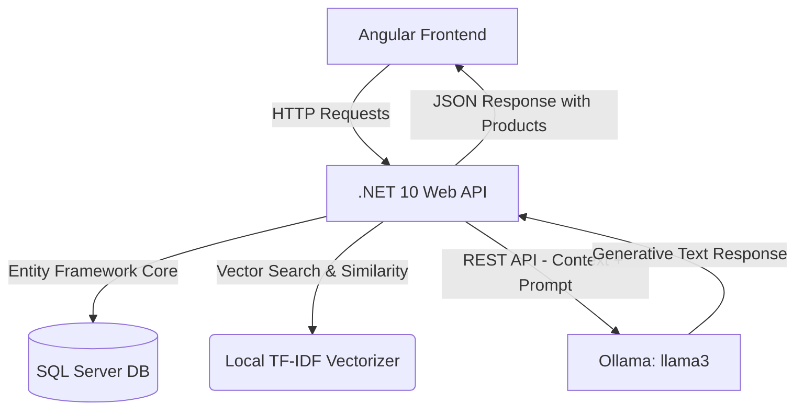

# AuraStore 🛍️ - E-Commerce with Angular and RAG Chatbot

Welcome to **AuraStore**, a modern, state-of-the-art e-commerce application powered by **Angular**, **.NET 10**, **SQL Server**, and **Retrieval-Augmented Generation (RAG)** using **Ollama**.

AuraStore delivers a premium shopping experience featuring advanced vector search, interactive catalog filters, dynamic cart functionality, and **Aura AI**—your local conversational AI assistant that retrieves matching store products from the SQL Database to answer your questions.

---

## 🏗️ Architecture



### 1. Frontend (Angular)
- Built using Angular's modern **Standalone Components**, **Signals** for reactive state management, and **computed signals** for performance-optimized filtering.
- Implements a stunning, highly responsive **glassmorphic design system** with custom micro-animations.

### 2. Backend (.NET 10 API)
- Built on top of ASP.NET Core and Entity Framework Core.
- Orchestrates semantic queries, database context extraction, and AI processing.

### 3. Vector & NLP Engine (100% Local RAG)
- **Semantic Vector Matcher**: Utilizes a custom local TF-IDF vectorizer in C# ([SemanticSearchService.cs](file:///d:/EcommercewithAngularandRAG/Backend/EcommerceApi/Services/SemanticSearchService.cs)) to build high-dimensional float vectors and calculate cosine similarity over product features without external dependencies.
- **LLM Generator**: Connects to a local **Ollama** server running `llama3` to generate conversational shopping advice based on products retrieved from the database. Falls back gracefully to a rules-based generator if Ollama is not running.

---

## ✨ Features

- 🔍 **Semantic Product Search**: Search for products conceptually rather than just by exact keyword matches (e.g. searching *"lighting"* will correctly score *"Aura Smart Ambient Light"*).
- 💬 **Interactive AI Assistant (Aura AI)**: Floating chat widget utilizing local RAG context matching.
- ⚡ **Suggested Quick-Action Chips**: Clickable pre-configured query buttons (e.g. *"Show products under $100"*, *"Recommend a keyboard"*) to instantly test the RAG flow.
- 🛒 **Rich Context Cart Cards**: Add items directly to your shopping cart straight from the AI's chat bubble suggestions.
- 🎛️ **Advanced Sidebar Filters**: Category-specific views and a smooth price slider.
- 📦 **Responsive Layout**: Designed with robust media queries and responsive `max-height` constraints to fit all screen sizes beautifully without scrolling issues.

---

## 🚀 Getting Started

### Prerequisites
- [Node.js](https://nodejs.org/) (v18+) & `npm`
- [.NET SDK 10.0](https://dotnet.microsoft.com/download/dotnet/10.0)
- [SQL Server LocalDB / Express](https://learn.microsoft.com/en-us/sql/database-engine/configure-windows/sql-server-express-localdb)
- [Ollama](https://ollama.com/) (Optional, needed for Generative RAG responses)

---

### Step 1: Start Ollama (Conversational Engine)
Install Ollama, open your terminal, and download/run the `llama3` model:
```bash
ollama run llama3
```
*Note: Keep this terminal window open. AuraStore will communicate with Ollama on port `11434`.*

---

### Step 2: Set Up and Run the Backend API
1. Navigate to the Backend folder:
   ```bash
   cd Backend/EcommerceApi
   ```
2. Update the Database Connection String in `appsettings.json` under `DefaultConnection` if you use a custom SQL Server instance.
3. Apply Database Migrations (seeds 10 premium initial products):
   ```bash
   dotnet ef database update
   ```
4. Run the API:
   ```bash
   dotnet run
   ```
The backend starts running locally at `http://localhost:5194`.

---

### Step 3: Set Up and Run the Frontend
1. Navigate to the Frontend folder:
   ```bash
   cd Frontend
   ```
2. Install dependencies:
   ```bash
   npm install
   ```
3. Start the Angular Dev Server:
   ```bash
   npm start
   ```
Open your browser to [http://localhost:4200](http://localhost:4200) to explore the store!

---

## 📂 Key Codebase Entry Points

- **Frontend Component logic**: [app.ts](file:///d:/EcommercewithAngularandRAG/Frontend/src/app/app.ts)
- **Frontend Template UI**: [app.html](file:///d:/EcommercewithAngularandRAG/Frontend/src/app/app.html)
- **Design & Styles**: [app.css](file:///d:/EcommercewithAngularandRAG/Frontend/src/app/app.css)
- **API RAG Coordinator**: [RagsService.cs](file:///d:/EcommercewithAngularandRAG/Backend/EcommerceApi/Services/RagsService.cs)
- **Local TF-IDF Vectorizer**: [SemanticSearchService.cs](file:///d:/EcommercewithAngularandRAG/Backend/EcommerceApi/Services/SemanticSearchService.cs)
- **Database Seeder**: [EcommerceDbContext.cs](file:///d:/EcommercewithAngularandRAG/Backend/EcommerceApi/Data/EcommerceDbContext.cs)
  
  

